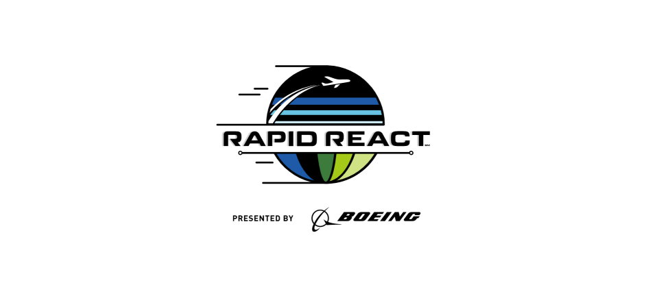

# FRC 2024 Offseason

The 8811 team’s offseason project in 2024, which is an improvement of the code used in the 2023 FRC Off-season China, with the competition theme being the 2022 RAPID REACT.

   

**Jan 2025**: Refactored project code based on Advantage Kit and Advantage Scope

**Aug. 2023**: Won the 3rd Prize in 2023 FRC Off-season China

**Jan. 2022**: 2022 FRC season topic released RAPID REACT
